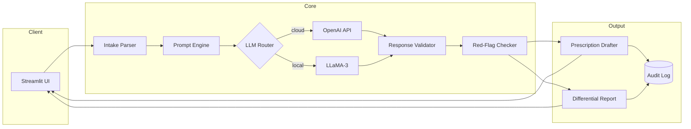
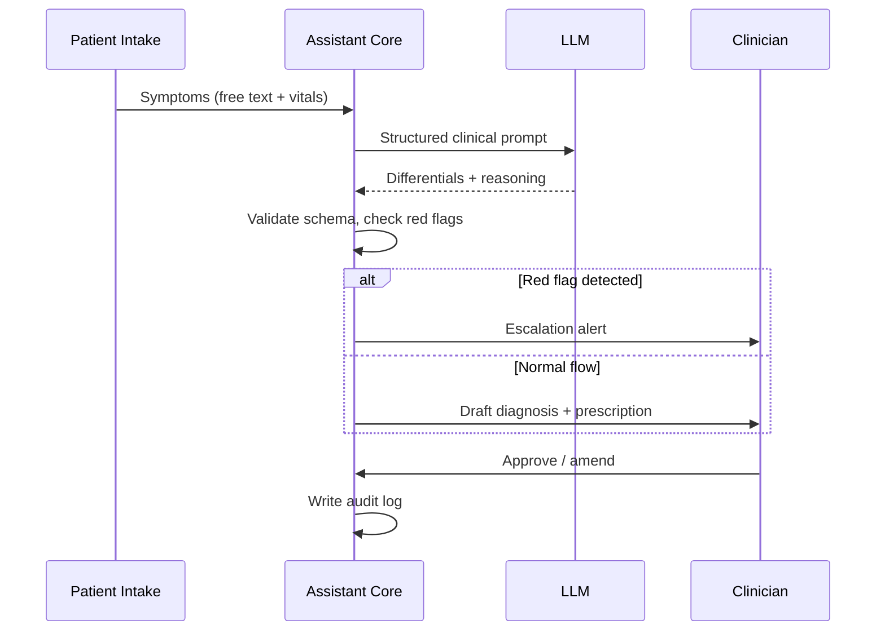
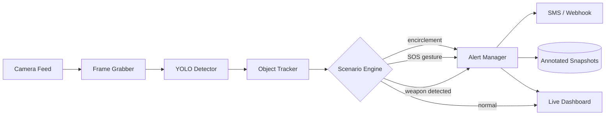
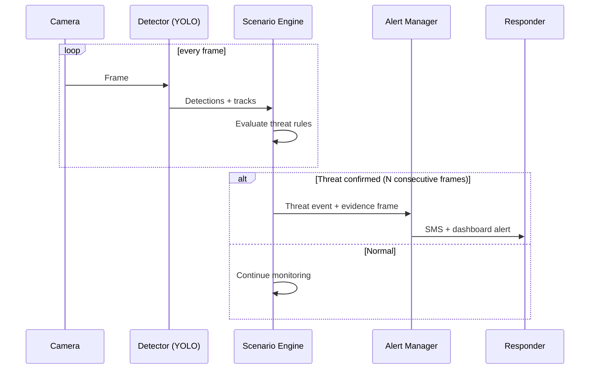
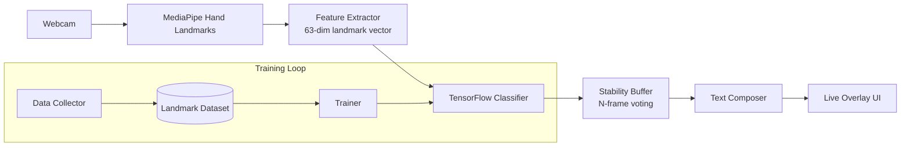
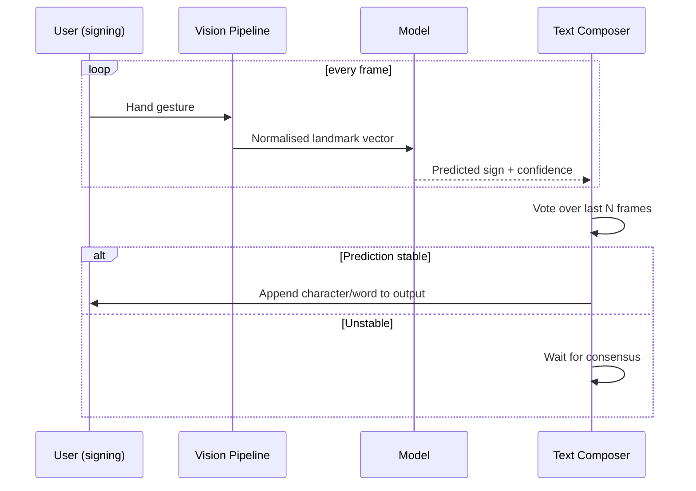
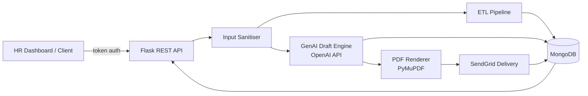
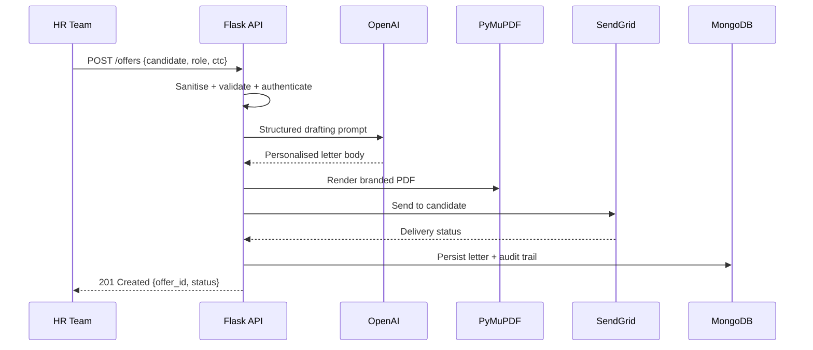

# Asapani Sravani — Project READMEs

Four premium project READMEs. Copy each section into its own repo's README.md.

1. MediMind AI — GenAI Clinical Assistant
2. Sentinel Vision — Women's Safety System
3. SignSpeak — Sign Language Detector
4. OfferForge — AI Offer Letter System


<!-- ══════════════════════════════════════════════════════════════ -->
<!-- ▼▼▼ PROJECT: README_clinical-assistant.md ▼▼▼ -->
<!-- ══════════════════════════════════════════════════════════════ -->

<div align="center">


**An LLM-powered clinical decision-support assistant that analyses symptoms, suggests differential diagnoses, and drafts structured prescriptions — built for speed, safety, and auditability.**

[](https://python.org)
[](https://platform.openai.com)
[](#)
[](https://streamlit.io)
[](LICENSE)
[](#contributing)

[Quick Start](#quick-start) · [Architecture](#architecture) · [How it Works](#how-it-works) · [Roadmap](#roadmap) · [Contributing](#contributing)

</div>

```text
════════════════════════════════════════════════════════════════════════════
```

## Why This Project Exists

Clinicians spend a disproportionate amount of time on documentation, and early-stage symptom triage is repetitive and error-prone. MediMind AI exists to compress that loop: a patient's symptoms go in, and a **structured, reviewable clinical draft** comes out — differential suggestions, red-flag alerts, and a prescription template a doctor can approve or amend in seconds.

> [!WARNING]
> MediMind AI is a **decision-support tool**, not a medical device. Every output requires review by a licensed clinician. Never use it for self-diagnosis or unsupervised prescribing.

## Key Features

| Feature | Description |
|:---|:---|
| **Symptom Analysis** | Natural-language symptom intake mapped to structured clinical signals |
| **Differential Suggestions** | Ranked candidate conditions with LLM-generated reasoning traces |
| **Prescription Drafting** | Structured drafts (drug, dose, frequency, duration) in an editable template |
| **Red-Flag Detection** | Escalation prompts for emergency-indicative symptom patterns |
| **Model Agnostic** | Runs on OpenAI API or local LLaMA-3 — switch with one config line |
| **Audit Trail** | Every prompt, response, and edit is logged for clinical review |

## Architecture



## Workflow



## Project Structure

```text
medimind-ai/
├── app/
│   ├── main.py              # Streamlit entry point
│   ├── intake.py            # Symptom parsing & normalisation
│   ├── prompts/             # Versioned prompt templates
│   ├── llm_router.py        # OpenAI / LLaMA-3 switching
│   ├── validator.py         # JSON-schema output validation
│   ├── redflags.py          # Emergency pattern rules
│   └── prescription.py      # Draft generation & formatting
├── configs/
│   └── config.yaml          # Model, safety, and UI settings
├── tests/
├── data/samples/            # Anonymised demo cases
├── requirements.txt
└── README.md
```

## Technologies Used

| Layer | Stack |
|:---|:---|
| LLM | OpenAI API (GPT-4-class), LLaMA-3 (local via Ollama) |
| Backend | Python 3.10+, Pydantic |
| UI | Streamlit |
| Validation | JSON Schema, custom clinical rule engine |
| Logging | SQLite audit store |

## Installation

```bash
git clone https://github.com/asapani-Sravani/medimind-ai.git
cd medimind-ai
python -m venv .venv && source .venv/bin/activate   # Windows: .venv\Scripts\activate
pip install -r requirements.txt
```

## Quick Start

```bash
export OPENAI_API_KEY="sk-..."      # or configure LLaMA-3 in config.yaml
streamlit run app/main.py
```

Open `http://localhost:8501`, enter a symptom description, and review the generated draft.

> [!TIP]
> No OpenAI key? Set `llm.provider: llama3` in `configs/config.yaml` to run fully offline with Ollama.

## Example Configuration

```yaml
# configs/config.yaml
llm:
  provider: openai          # openai | llama3
  model: gpt-4o-mini
  temperature: 0.2          # keep low for clinical consistency
safety:
  red_flag_rules: strict
  require_clinician_ack: true
audit:
  store: sqlite:///audit.db
```

## Example Output

```json
{
  "differentials": [
    { "condition": "Acute pharyngitis", "confidence": "high",
      "reasoning": "Fever + sore throat + no cough, 3-day onset" },
    { "condition": "Infectious mononucleosis", "confidence": "moderate" }
  ],
  "red_flags": [],
  "prescription_draft": {
    "drug": "Azithromycin", "dose": "500 mg", "frequency": "OD",
    "duration": "3 days", "status": "PENDING_CLINICIAN_REVIEW"
  }
}
```

## How It Works

<details>
<summary><b>1. Intake normalisation</b></summary>

Free-text symptoms are parsed into a structured clinical object (onset, duration, severity, associated signs) so the LLM receives consistent, schema-shaped context rather than raw prose.

</details>

<details>
<summary><b>2. Constrained generation</b></summary>

Prompt templates force JSON-schema output. Any response that fails validation is automatically retried with corrective feedback — malformed clinical data never reaches the UI.

</details>

<details>
<summary><b>3. Safety gate</b></summary>

A deterministic rule engine (not the LLM) scans for red-flag patterns — chest pain, neurological deficits, paediatric fever thresholds — and escalates before any draft is shown.

</details>

## AI / Agent Workflow

The assistant runs a bounded three-step agent loop — **parse → generate → verify** — with the verifier holding veto power. The LLM proposes; deterministic code disposes. This keeps hallucinated dosages or conditions from ever reaching the clinician unreviewed.

## Folder Explanation

| Folder | Purpose |
|:---|:---|
| `app/prompts/` | Versioned prompt templates — changes are diffable and reviewable |
| `app/redflags.py` | Deterministic safety rules, deliberately kept outside the LLM |
| `data/samples/` | Anonymised cases for demos and regression tests |
| `tests/` | Schema validation and red-flag unit tests |

## Screenshots

| Symptom Intake | Differential Report | Prescription Draft |
|:---:|:---:|:---:|
|  |  |  |

## Roadmap

- [ ] Drug-interaction checking against a formulary database
- [ ] Multilingual symptom intake (Telugu, Hindi)
- [ ] FHIR export for EHR integration
- [ ] Fine-tuned local model for offline clinics
- [ ] Clinician feedback loop for continuous prompt improvement

## Known Limitations

> [!NOTE]
> - Outputs depend on LLM quality; low-resource local models produce weaker differentials.
> - No integration with real formularies yet — dosage drafts are template-based.
> - English-first; other languages degrade parsing accuracy.
> - Not validated for paediatric or oncology use cases.

## Contributing

1. Fork the repo and create a feature branch: `git checkout -b feat/your-feature`
2. Run tests: `pytest`
3. Open a PR with a clear description — prompt template changes require a sample-case diff.

> [!IMPORTANT]
> Contributions touching safety rules (`redflags.py`) require two maintainer reviews.

## License

Distributed under the **MIT License**. See [`LICENSE`](LICENSE) for details.

## Contact

**Asapani Sravani** — AI/ML Engineer
[Email](mailto:asapanisravani49@gmail.com) · [LinkedIn](https://www.linkedin.com/in/asapani-sravani-3234922b7) · [GitHub](https://github.com/asapani-Sravani)

## Credits

Built with OpenAI API, Meta LLaMA-3, and Streamlit. Inspired by the clinicians who reviewed early drafts and told us exactly what was wrong with them.

```text
════════════════════════════════════════════════════════════════════════════
```

<div align="center"><sub>If this project helps you, consider giving it a ⭐ — it helps others find it.</sub></div>


<!-- ══════════════════════════════════════════════════════════════ -->
<!-- ▼▼▼ PROJECT: README_womens-safety.md ▼▼▼ -->
<!-- ══════════════════════════════════════════════════════════════ -->

<div align="center">


**A real-time computer-vision system that detects threat scenarios from live camera feeds using YOLO object detection and triggers instant alerts — built to make public spaces safer.**

[](https://python.org)
[](https://github.com/ultralytics/ultralytics)
[](https://opencv.org)
[](#how-it-works)
[](LICENSE)

[Quick Start](#quick-start) · [Architecture](#architecture) · [How it Works](#how-it-works) · [Roadmap](#roadmap)

</div>

```text
════════════════════════════════════════════════════════════════════════════
```

## Why This Project Exists

Most surveillance is *reactive* — footage is reviewed after an incident. Sentinel Vision makes cameras *proactive*: it watches for threat indicators (a lone woman surrounded, distress gestures, weapon presence, unsafe crowd ratios at night) and raises an alert **while intervention is still possible**, not after.

> [!NOTE]
> Detection is fully on-device. No footage leaves the machine unless an alert fires — privacy is a design constraint, not an afterthought.

## Key Features

| Feature | Description |
|:---|:---|
| **Real-Time Detection** | YOLO-based person/object detection at 25+ FPS on consumer GPUs |
| **Threat Scenario Engine** | Rule layer over detections: encirclement, night-time isolation, gesture SOS |
| **Gender-Ratio Analysis** | Flags high-risk crowd compositions in configurable zones and hours |
| **Instant Alerts** | SMS / webhook / dashboard alerts with annotated frame snapshots |
| **90%+ Accuracy** | Validated on held-out test scenarios across lighting conditions |
| **Edge-Friendly** | Runs on Jetson-class devices with model quantisation |

## Architecture



## Workflow



## Project Structure

```text
sentinel-vision/
├── src/
│   ├── main.py              # Pipeline entry point
│   ├── detector.py          # YOLO inference wrapper
│   ├── tracker.py           # Multi-object tracking (IoU/DeepSORT)
│   ├── scenarios/           # Threat rule definitions
│   │   ├── encirclement.py
│   │   ├── sos_gesture.py
│   │   └── night_isolation.py
│   ├── alerts.py            # SMS / webhook dispatch
│   └── dashboard.py         # Live annotated stream
├── models/                  # YOLO weights (.pt)
├── configs/config.yaml
├── tests/
└── README.md
```

## Technologies Used

| Layer | Stack |
|:---|:---|
| Detection | YOLOv8 (Ultralytics), custom-trained weights |
| Vision | OpenCV, NumPy |
| Tracking | IoU tracker / DeepSORT |
| Alerts | Twilio SMS, webhooks |
| Dashboard | Streamlit live view |

## Installation

```bash
git clone https://github.com/asapani-Sravani/sentinel-vision.git
cd sentinel-vision
python -m venv .venv && source .venv/bin/activate
pip install -r requirements.txt
# GPU strongly recommended: install CUDA-enabled torch first
```

## Quick Start

```bash
# webcam
python src/main.py --source 0

# RTSP camera
python src/main.py --source rtsp://<camera-ip>/stream --config configs/config.yaml
```

> [!TIP]
> Start with `--display` to see live annotated output and tune scenario thresholds before enabling SMS alerts.

## Example Configuration

```yaml
# configs/config.yaml
detector:
  weights: models/yolov8s-safety.pt
  confidence: 0.45
scenarios:
  encirclement:
    min_persons: 3
    radius_px: 120
    consecutive_frames: 15     # ~0.6s — avoids single-frame false alarms
  night_isolation:
    active_hours: ["21:00", "05:00"]
alerts:
  sms_to: ["+91XXXXXXXXXX"]
  webhook: https://your-server/alert
```

## Example Output

```text
[2026-07-23 22:41:07] ALERT  scenario=encirclement  confidence=0.93
  persons=4  target_track_id=7  zone=gate-2  frame=evidence/22-41-07.jpg
  → SMS sent to 1 responder · webhook 200 OK
```

## How It Works

<details>
<summary><b>1. Detect &amp; track</b></summary>

YOLO detects persons and threat objects per frame; a lightweight tracker assigns persistent IDs so the scenario engine reasons about *behaviour over time*, not single frames.

</details>

<details>
<summary><b>2. Scenario rules, not raw detections</b></summary>

An alert never fires from one detection. Rules require spatial conditions (e.g., ≥3 persons within a radius of a tracked individual) sustained across N consecutive frames — this is what pushes precision past 90%.

</details>

<details>
<summary><b>3. Evidence-first alerting</b></summary>

Every alert ships with the annotated evidence frame and scenario metadata, so responders can verify in seconds instead of scrubbing footage.

</details>

## Folder Explanation

| Folder | Purpose |
|:---|:---|
| `src/scenarios/` | Each threat pattern is an isolated, testable rule module |
| `models/` | Trained YOLO weights; swap without touching code |
| `tests/` | Recorded-clip regression tests for each scenario |

## Screenshots

| Live Detection | Encirclement Alert | Dashboard |
|:---:|:---:|:---:|
|  |  |  |

## Roadmap

- [ ] Audio distress detection (scream classification) as a second signal
- [ ] Pose-estimation-based SOS gestures (MediaPipe)
- [ ] Multi-camera zone hand-off tracking
- [ ] TensorRT / INT8 quantisation for Jetson deployment
- [ ] Direct police-control-room API integration

## Known Limitations

> [!WARNING]
> - Accuracy degrades in heavy rain, fog, or near-zero lighting without IR cameras.
> - Gesture rules are tuned per camera angle; new installs need threshold calibration.
> - This system **assists** responders — it must never replace human judgment or emergency services.

## Contributing

1. Fork → branch (`feat/...`) → PR against `main`
2. New scenario rules must ship with a recorded test clip in `tests/clips/`
3. Run `pytest && python tests/run_clips.py` before submitting

## License

**MIT** — see [`LICENSE`](LICENSE).

## Contact

**Asapani Sravani** — AI/ML Engineer
[Email](mailto:asapanisravani49@gmail.com) · [LinkedIn](https://www.linkedin.com/in/asapani-sravani-3234922b7) · [GitHub](https://github.com/asapani-Sravani)

## Credits

Ultralytics YOLO, OpenCV community, and the safety-research datasets that made scenario validation possible.

```text
════════════════════════════════════════════════════════════════════════════
```

<div align="center"><sub>Built because "someone should do something" is best answered with working code. ⭐</sub></div>


<!-- ══════════════════════════════════════════════════════════════ -->
<!-- ▼▼▼ PROJECT: README_sign-language.md ▼▼▼ -->
<!-- ══════════════════════════════════════════════════════════════ -->

<div align="center">


**A computer-vision system that recognises sign language gestures from a live camera feed and translates them to text in real time — improving with every training iteration.**

[](https://python.org)
[](https://tensorflow.org)
[](https://opencv.org)
[](https://developers.google.com/mediapipe)
[](LICENSE)

[Quick Start](#quick-start) · [Architecture](#architecture) · [Training](#how-it-works) · [Roadmap](#roadmap)

</div>

```text
════════════════════════════════════════════════════════════════════════════
```

## Why This Project Exists

Millions of people sign every day, and most software still cannot understand a single gesture. SignSpeak is a step toward closing that gap: a camera-only pipeline (no gloves, no sensors) that turns signs into text — cheap enough to run on a laptop, accurate enough to keep improving release over release.

## Key Features

| Feature | Description |
|:---|:---|
| **Real-Time Recognition** | Live webcam gestures → text at interactive frame rates |
| **Landmark-Based Pipeline** | MediaPipe hand landmarks instead of raw pixels — smaller, faster models |
| **Iterative Training Loop** | Built-in data-collection mode; every session grows the dataset |
| **Word Composition** | Stable-prediction buffering assembles letters/signs into words |
| **Sensor-Free** | Any standard webcam — no hardware beyond a camera |

## Architecture



## Workflow



## Project Structure

```text
signspeak/
├── src/
│   ├── app.py               # Live recognition entry point
│   ├── collect.py           # Dataset collection mode
│   ├── train.py             # Model training script
│   ├── landmarks.py         # MediaPipe extraction + normalisation
│   ├── model.py             # TensorFlow architecture
│   └── composer.py          # Stability voting & word assembly
├── data/                    # Collected landmark datasets (.npz)
├── models/                  # Trained checkpoints (.h5)
├── notebooks/               # Training experiments
├── requirements.txt
└── README.md
```

## Technologies Used

| Layer | Stack |
|:---|:---|
| Landmarks | MediaPipe Hands |
| Model | TensorFlow / Keras (dense + LSTM variants) |
| Vision | OpenCV |
| Data | NumPy, scikit-learn (splits, metrics) |

## Installation

```bash
git clone https://github.com/asapani-Sravani/signspeak.git
cd signspeak
python -m venv .venv && source .venv/bin/activate
pip install -r requirements.txt
```

## Quick Start

```bash
# run live recognition with the bundled model
python src/app.py

# collect new training samples for the sign "hello" (200 frames)
python src/collect.py --label hello --samples 200

# retrain with your expanded dataset
python src/train.py --epochs 50
```

> [!TIP]
> Collect samples under the same lighting you'll use for recognition — landmark quality drives everything downstream.

## Example Configuration

```yaml
# configs/config.yaml
model:
  checkpoint: models/signspeak_v3.h5
  confidence_threshold: 0.85
composer:
  stability_frames: 12        # frames of agreement before committing a sign
  idle_gap_ms: 800            # pause that ends a word
camera:
  index: 0
  flip: true
```

## Example Output

```text
[frame 1042] sign=H (0.97)  buffer=H
[frame 1054] sign=I (0.94)  buffer=HI
[idle 812ms] word committed → "HI"
Live transcript: HI HOW ARE YOU
```

## How It Works

<details>
<summary><b>1. Landmarks, not pixels</b></summary>

Instead of feeding raw images to a heavy CNN, MediaPipe reduces each hand to 21 3-D landmarks (63 values). The classifier trains in minutes on a laptop and is robust to background, skin tone, and lighting variation.

</details>

<details>
<summary><b>2. Normalisation</b></summary>

Landmarks are translated to the wrist origin and scaled by hand size, making predictions distance- and position-invariant across users.

</details>

<details>
<summary><b>3. Stability voting</b></summary>

Single-frame predictions flicker. The composer commits a sign only after N consecutive agreeing frames, and an idle gap terminates a word — this is what makes the transcript readable.

</details>

<details>
<summary><b>4. The improvement loop</b></summary>

`collect.py` makes adding data trivial: every misrecognised sign becomes tomorrow's training sample. The model "gets better every iteration" because iteration is a first-class feature, not an afterthought.

</details>

## Folder Explanation

| Folder | Purpose |
|:---|:---|
| `data/` | Landmark datasets — small `.npz` files, safe to version |
| `models/` | Checkpoints named by version and accuracy |
| `notebooks/` | Architecture experiments (dense vs LSTM vs attention) |

## Screenshots

| Live Recognition | Data Collection | Training Curves |
|:---:|:---:|:---:|
|  |  |  |

## Roadmap

- [ ] Dynamic (motion-based) sign support with LSTM sequence models
- [ ] Indian Sign Language (ISL) vocabulary expansion
- [ ] Text-to-speech output for spoken conversation
- [ ] Mobile deployment via TensorFlow Lite
- [ ] Two-hand sign support

## Known Limitations

> [!NOTE]
> - Static-gesture bias: motion-heavy signs need the LSTM branch (in progress).
> - Vocabulary is limited to trained signs; out-of-vocabulary gestures are rejected, not guessed.
> - Single-hand focus; two-hand interaction is on the roadmap.

## Contributing

1. Fork → `feat/your-feature` → PR
2. New signs must include a contributed dataset (`collect.py` output) and updated eval metrics
3. `pytest` must pass; include before/after accuracy in the PR description

## License

**MIT** — see [`LICENSE`](LICENSE).

## Contact

**Asapani Sravani** — AI/ML Engineer
[Email](mailto:asapanisravani49@gmail.com) · [LinkedIn](https://www.linkedin.com/in/asapani-sravani-3234922b7) · [GitHub](https://github.com/asapani-Sravani)

## Credits

Google MediaPipe team, TensorFlow, and the deaf community advocates whose feedback shaped the composer design.

```text
════════════════════════════════════════════════════════════════════════════
```

<div align="center"><sub>Every gesture understood is a conversation unlocked. ⭐</sub></div>


<!-- ══════════════════════════════════════════════════════════════ -->
<!-- ▼▼▼ PROJECT: README_offer-letter-system.md ▼▼▼ -->
<!-- ══════════════════════════════════════════════════════════════ -->

<div align="center">


**A production GenAI system that generates, personalises, and delivers offer letters end-to-end — cutting HR document turnaround time by ~60%. Actively used by a real HR team.**

[](https://python.org)
[](https://flask.palletsprojects.com)
[](https://platform.openai.com)
[](https://mongodb.com)
[](https://sendgrid.com)
[](#)

[Quick Start](#quick-start) · [Architecture](#architecture) · [API](#example-output) · [Security](#how-it-works)

</div>

```text
════════════════════════════════════════════════════════════════════════════
```

## Why This Project Exists

Every offer letter used to be a manual pipeline: copy a template, fill candidate details, get the formatting wrong, export, attach, email, log it in a sheet. Multiply by every hire. OfferForge replaces that with one API call — **generate → render → deliver → track** — and gave the HR team ~60% of that time back.

> [!NOTE]
> This is not a demo. OfferForge runs in production at Innotrat Labs and processes real offer letters for real hires.

## Key Features

| Feature | Description |
|:---|:---|
| **GenAI Drafting** | OpenAI API personalises tone and role-specific clauses per candidate |
| **PDF Pipeline** | PyMuPDF renders branded, pixel-consistent offer letters |
| **Automated Delivery** | SendGrid dispatch with delivery status tracked in MongoDB |
| **REST API** | Clean Flask endpoints — integrates with any HR frontend |
| **ETL Pipelines** | Candidate data ingested and normalised from spreadsheets/ATS exports |
| **Hardened by Default** | Input sanitisation, token auth, secrets management — zero unvalidated entry points |

## Architecture



## Workflow



## Project Structure

```text
offerforge/
├── app/
│   ├── api/                 # Flask blueprints (offers, templates, status)
│   ├── core/
│   │   ├── generator.py     # OpenAI drafting logic
│   │   ├── renderer.py      # PyMuPDF PDF assembly
│   │   └── mailer.py        # SendGrid integration
│   ├── etl/                 # Candidate data ingestion pipelines
│   ├── security/            # Auth, sanitisation, secrets loading
│   └── models/              # MongoDB schemas (pydantic)
├── templates/               # Letter templates + brand assets
├── tests/
├── .env.example
└── README.md
```

## Technologies Used

| Layer | Stack |
|:---|:---|
| API | Flask, Gunicorn |
| GenAI | OpenAI API (structured prompts, low temperature) |
| Documents | PyMuPDF |
| Data | MongoDB, PyMongo, Pandas (ETL) |
| Delivery | SendGrid |
| Security | Token auth, env-based secrets, input sanitisation |

## Installation

```bash
git clone https://github.com/asapani-Sravani/offerforge.git
cd offerforge
python -m venv .venv && source .venv/bin/activate
pip install -r requirements.txt
cp .env.example .env        # fill in your keys
```

## Quick Start

```bash
# start MongoDB, then:
flask --app app run --debug
```

```bash
curl -X POST http://localhost:5000/api/v1/offers \
  -H "Authorization: Bearer $API_TOKEN" \
  -H "Content-Type: application/json" \
  -d '{"name": "Jane Doe", "role": "ML Engineer", "ctc": "12 LPA", "joining": "2026-08-01"}'
```

## Example Configuration

```bash
# .env
OPENAI_API_KEY=sk-...
SENDGRID_API_KEY=SG....
MONGO_URI=mongodb://localhost:27017/offerforge
API_TOKEN_SECRET=<random-256-bit>
LETTER_TEMPLATE=templates/standard_v2.json
```

## Example Output

```json
POST /api/v1/offers → 201 Created
{
  "offer_id": "OF-2026-0142",
  "candidate": "Jane Doe",
  "status": "DELIVERED",
  "pdf_url": "/offers/OF-2026-0142.pdf",
  "delivered_at": "2026-07-23T11:42:08Z",
  "turnaround_seconds": 41
}
```

## How It Works

<details>
<summary><b>1. Constrained generation</b></summary>

The LLM fills only the personalisable regions of a locked template (greeting tone, role summary, growth clauses). Compensation figures, dates, and legal text are injected programmatically — the model can never alter a number.

</details>

<details>
<summary><b>2. ETL before generation</b></summary>

Candidate data arrives messy (ATS exports, spreadsheets). The ETL layer normalises names, roles, and CTC formats into validated MongoDB documents before any letter is drafted — reducing manual data handling by 25%.

</details>

<details>
<summary><b>3. Security as a pipeline stage</b></summary>

Every request passes through sanitisation and token authentication before touching business logic. Secrets live in the environment, never the codebase. Result: zero unvalidated data entry points in production.

</details>

## AI / Agent Workflow

Generation runs as a bounded agent chain: **validate input → draft with LLM → verify placeholders resolved → render → deliver → log**. Each stage can reject and halt the chain; a letter that fails placeholder verification is never rendered, and a render failure is never emailed. Deterministic gates around a generative core.

## Folder Explanation

| Folder | Purpose |
|:---|:---|
| `app/security/` | All auth and sanitisation logic in one auditable place |
| `app/etl/` | Ingestion pipelines, isolated from API code |
| `templates/` | Versioned letter templates — legal-reviewed, LLM-locked regions marked |
| `tests/` | API contract tests + prompt regression tests |

## Screenshots

| API in Action | Generated Letter | Delivery Dashboard |
|:---:|:---:|:---:|
|  |  |  |

## Roadmap

- [ ] E-signature integration (DocuSign / Zoho Sign)
- [ ] Multi-template support (internships, contractors, promotions)
- [ ] Candidate portal with accept/decline tracking
- [ ] Docker + cloud deployment recipes (GCP)
- [ ] Analytics: time-to-accept and offer-conversion dashboards

## Known Limitations

> [!WARNING]
> - Template regions must be legally reviewed before enabling new LLM-editable zones.
> - SendGrid delivery status is eventually consistent; "DELIVERED" can lag by minutes.
> - Single-tenant design; multi-org support requires schema changes.

## Contributing

1. Fork → `feat/...` branch → PR
2. Run `pytest` — API contract tests must pass
3. Changes to `app/security/` or letter templates require maintainer review

## License

**MIT** — see [`LICENSE`](LICENSE).

## Contact

**Asapani Sravani** — AI/ML Engineer, Innotrat Labs
[Email](mailto:asapanisravani49@gmail.com) · [LinkedIn](https://www.linkedin.com/in/asapani-sravani-3234922b7) · [GitHub](https://github.com/asapani-Sravani)

## Credits

Built at Innotrat Labs with OpenAI, PyMuPDF, and SendGrid — and battle-tested by the HR team who used it on day one and filed the first bug within the hour.

```text
════════════════════════════════════════════════════════════════════════════
```

<div align="center"><sub>Ship the boring automation. It's the one people use every day. ⭐</sub></div>
